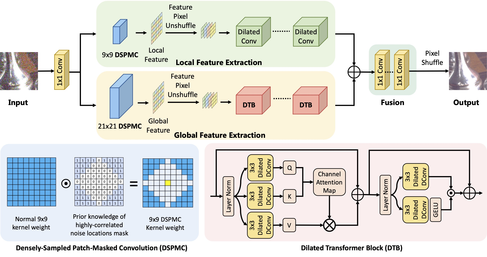
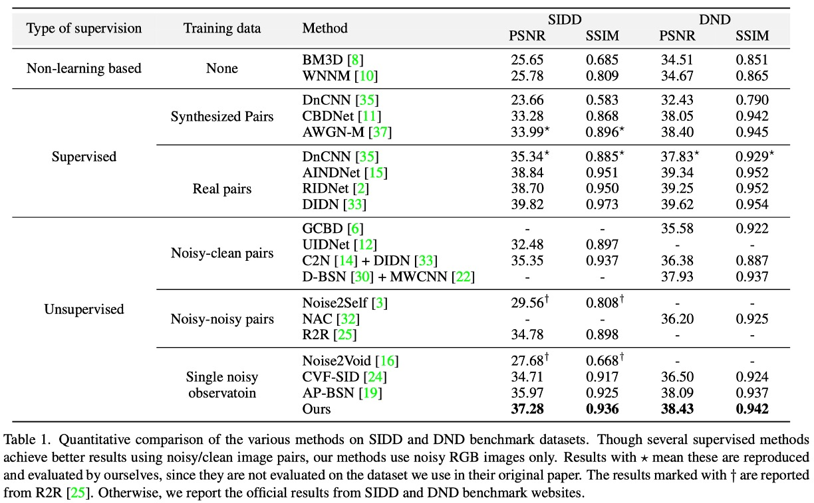
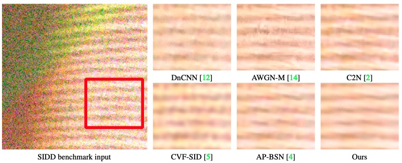
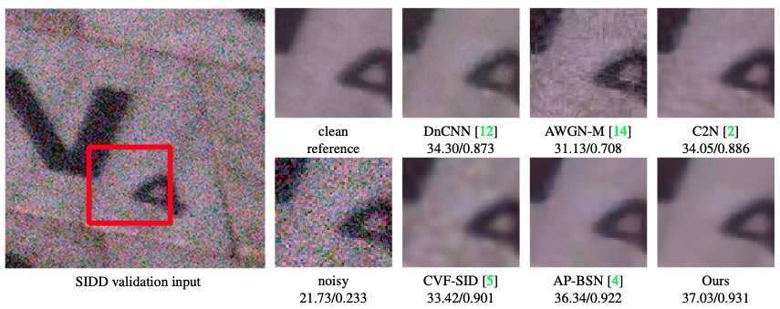

# LG-BPN: Local and Global Blind-Patch Network for Self-Supervised Real-World Denoising

Zichun Wang, [Ying Fu](https://ying-fu.github.io/), Ji Liu, [Yulun Zhang](http://yulunzhang.com/), "LG-BPN: Local and Global Blind-Patch Network for Self-Supervised Real-World Denoising", CVPR, 2023

[[arXiv](https://arxiv.org/abs/2304.00534)]




## Abstract
_Despite the significant results on synthetic noise under simplified assumptions, most self-supervised denoising methods fail under real noise due to the strong spatial noise correlation, including the advanced self-supervised blind-spot networks (BSNs). For recent methods targeting at real-world denoising, they either suffer from ignoring this spatial correlation, or are limited by the destruction of fine textures for under-considering the correlation. In this paper, we present a novel method for self-supervised real-world denoising, which takes the spatial correlation statistic into our network design for local detail restoration, and also brings the long-range dependencies modeling ability to previously CNN-based BSN methods. First, based on the correlation statistic, we propose a densely-sampled patch-masked convolution module. By taking more neighbor pixels with low noise correlation into account, we enable a denser local receptive field, preserving more useful information for enhanced fine structure recovery. Second, we propose a dilated Transformer block to allow distant context exploitation in BSN. This global perception address the intrinsic deficiency of BSN, whose receptive field is constrained by the blind spot requirement, which can not be fully resolved by the previous CNN-based BSNs. These two designs enable our method fully exploit both the detailed structures and the global interaction in a blind manner. Extensive results on real-world datasets demonstrate the superior performance of our method._


## Setup

### Requirements

- Python 3.7.11
- PyTorch 1.8.2
- numpy 1.21.2
- opencv 4.5.5
- scikit-image 0.16.2


## Contents

<!-- 1. [Dataset](#Dataset)
1. [Training&Testing](#Training&Testing)
1. [Results](#Results)
1. [Acknowledgement](#Acknowledgement) -->

[1. Dataset](#1) 

[2. Training & Testing](#2) 

[3. Results](#3) 

[4. Citation](#4) 

[5. Acknowledgement](#5) 

<p id="1"></p > 

## Dataset

We follow the dataset setup in AP-BSN. Please click [this link](https://github.com/wooseoklee4/AP-BSN#directory) for detailed preparation description.


<p id="2"></p > 

## Training & Testing

### Training 

```
usage: python train.py [-c CONFIG_FILE_NAME] [-g GPU_NUM] 
                       [-s SESSION_NAME] [-r] [--thread THREAD_NUM]

Train model.

Arguments:      
  -c CONFIG_FILE_NAME              Configuration file name. (only file name in ./conf, w/o '.yaml') 
  -g GPU_NUM                       GPU ID(number). Only support single gpu setting.
  -s SESSION_NAME      (optional)  Name of training session (default: configuration file name)
  -r                   (optional)  Flag for resume training. (On: resume, Off: starts from scratch)
  --thread THREAD_NUM  (optional)  Number of thread for dataloader. (default: 4)
```


Examples:

#### Train our method for the SIDD dataset using gpu:0
```
python train.py -s your_SIDD_model_name -c APBSN_SIDD/BSN_SIDD -g '0'
```

#### Train our method for the DND dataset using gpu:0
```
python train.py -s your_DND_model_name -c APBSN_DND/BSN_DND -g '0'
```

### Test

```
usage: python test.py [-c CONFIG_FILE_NAME] [-g GPU_NUM] 
(model select)        [-e CKPT_EPOCH] [--pretrained MODEL] 
                      [-s SESSION_NAME] [--thread THREAD_NUM] [--test_img IMAGE] [--test_dir DIR]

Test dataset or a image using pre-trained model.

Arguments:      
  -c CONFIG_FILE_NAME              Configuration file name. (only file name in ./conf, w/o '.yaml') 
  -g GPU_NUM                       GPU ID(number). Only support single gpu setting.
  -e CKPT_EPOCH                    Epoch number of checkpoint. (disabled when --pretrained is on)
  --pretrained MODEL   (optional)  Explicit directory of pre-trained model in ckpt folder.
  -s SESSION_NAME      (optional)  Name of training session (default: configuration file name)
  --thread THREAD_NUM  (optional)  Number of thread for dataloader. (default: 4)
  --test_img IMAGE     (optional)  Image directory to denoise a single image. (default: test dataset in config file)
  --test_dir DIR       (optional)  Directory of images to denoise.
```


Examples:

#### Test SIDD dataset for 20 epoch model in gpu:0

Please download the model trained on SIDD medium from [this link](https://drive.google.com/file/d/1AgRYGoAoo6rtlaf5FtDQQxsoZpmgWDxO/view?usp=share_link). Put it in path
```
/output/LGBPN_SIDD/checkpoint/LGBPN_SIDD_20.pth
```

Then run:
```
# You can find corresponding results in Table 1 of the main paper.
python test.py -s your_SIDD_model -c APBSN_SIDD -g 0 -e 20
```

#### Test DND dataset for 20 epoch model in gpu:0

Please download the model trained on DND from [this link](https://drive.google.com/file/d/1S7j9PQXipAp0YfdMqUwnN_JJui1hAWSE/view?usp=share_link). Put it in path
```
/output/LGBPN_DND/checkpoint/LGBPN_DND_20.pth
```

Then run:
```
# You can find corresponding results in Table 1 of the main paper.
python test.py -s your_DND_model -c APBSN_DND -g 0 -e 20
```


---

<p id="3"></p >

## Results

### Quantitative results



Please refer our paper for more detailed results.


### Qualitative results






<p id="4"></p >

## Citation

If you find the code helpful in your resarch or work, please cite the following paper(s).
```
@inproceedings{wang2023lgbpn,
title={{LG}-{BPN}: Local and Global Blind-Patch Network for Self-Supervised Real-World Denoising},
author={Wang, Zichun and Fu, Ying and Liu, Ji and Zhang, Yulun},
booktitle={CVPR},
year={2023}
}
```

<p id="5"></p >

## Acknowledgement

The codes are based on [AP-BSN](https://github.com/wooseoklee4/AP-BSN). Thanks for their awesome works.
